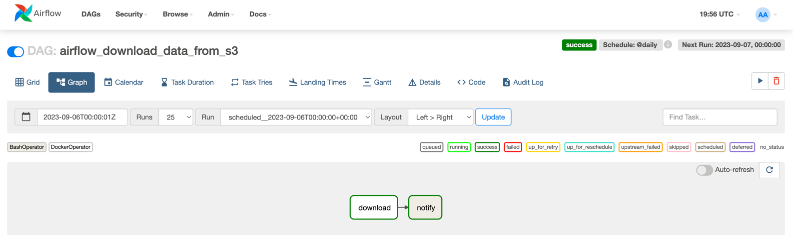
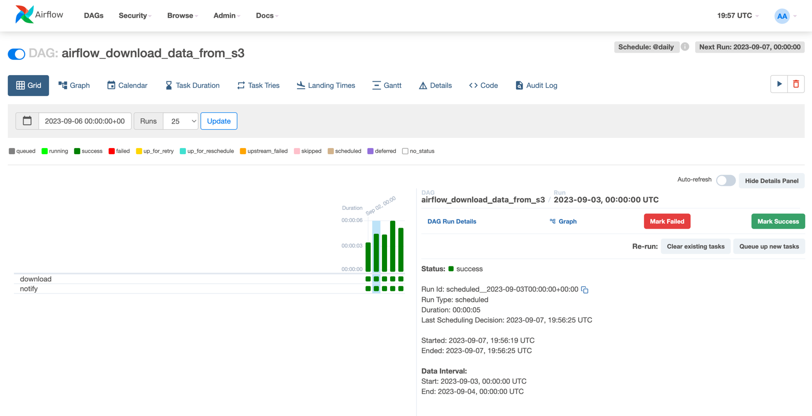
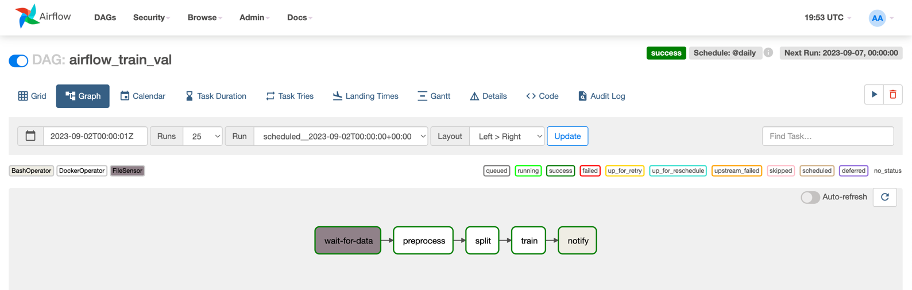
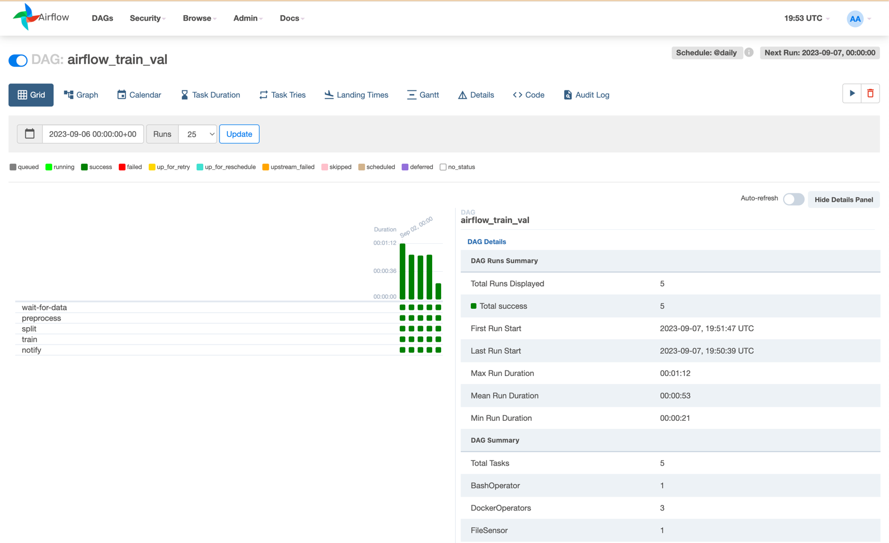

# ctr_project_airflow

## Sem5. Airflow
В этом занятии мы настроим обучение модели, 
как если новые продовые данные на обучение к нам поступали бы постоянно каждый день. 
Для этого построим пайплайн данных в виде направленного ацикличного графа (Directed Acyclic Graph, DAG).
В этом нам поможет инструмент [Airflow](https://airflow.apache.org/docs/apache-airflow/stable/core-concepts/overview.html).

Чтобы поднять Airflow мы будем использовтаь [docker-compose](https://docs.docker.com/compose/). Реализуем 2 DAG'а
- `download` для ежедневной выгрузки данных из S3 
- `train_val` для ежедневного переобучения модели на новых даыннх и ее сериализации

Основные этапы внутри DAG'ов реализуем с помощью [DockerOperator](https://airflow.apache.org/docs/apache-airflow/1.10.10/_api/airflow/operators/docker_operator/index.html). 
Также используем [FileSensor](https://airflow.apache.org/docs/apache-airflow/1.10.14/_api/airflow/contrib/sensors/file_sensor/index.html) 
для проверки наличия данных перед запуском пайплайна.

### Результаты
После сборки цепочки Docker образов мы сможем их запустить с помощью `docker compose up`.
UI Airflow будет доступен по адресу `localhost:8080`. В UI будут также отображены DAG'и,
мы сможем увидеть их структуру, расписание и статусы каждого запуска.

